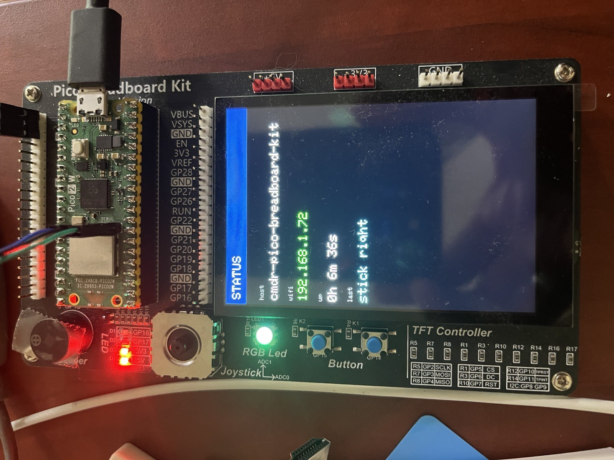

# cmdr-pico-breadboard-kit

The [GeeekPi Pico Breadboard Kit](https://wiki.52pi.com/index.php?title=EP-0172) —
3.5" touch TFT, joystick, buttons, LEDs, RGB LED and a buzzer — running as a
[commander](https://github.com/gbryant/commander) project on a **Pico 2 W (RP2350)**.

Every peripheral on the board is a commander module, so the whole device is
reachable from a shell over USB serial or telnet:

```
> lcd test                  colour bars, border and text on the panel
> touch watch               stream touch coordinates
> joy                       stick position and direction
> btn                       button states and press counts
> led 0 blink 250
> buzz play c4:200,e4:200,g4:400
> wled 0 40 0               the RGB LED
> kit selftest              exercise everything in turn
```

`main.cpp` contains no driver code — the drivers are framework modules. What's
here is the *composition*: which screen is showing, what a touch means right now,
what the stick and buttons do.



*The Status screen: hostname, IP, uptime and the last input event. The RGB LED is
green, the SWD cable on the left goes to the probe that flashed it.*

## Screens

| Screen | What it shows |
|--------|---------------|
| **Status** | hostname, IP, uptime, and the last input event — the default screen |
| **Piano** | eight touch keys across the panel; the buzzer plays, the RGB LED follows the key |
| **Splash** | the boot card |

Controls, on any screen:

| Input | Action |
|-------|--------|
| touch | Piano: play a key. Status: report the coordinate |
| stick left / right | previous / next screen |
| stick up / down | backlight brighter / dimmer (Piano: transpose an octave) |
| button 0 / 1 | toggle LED 0 / 1, with a click |
| `kit …` | the same things from the shell |

## Hardware

Pin assignments are the kit's, recorded in `cmdr.toml`. Change them there and run
`cmdr regen` — nothing is hardcoded in the app.

| Peripheral | Wiring | Module |
|------------|--------|--------|
| 3.5" TFT, ST7796S, 320×480 | SPI0 — SCK GP2, MOSI GP3, CS GP5, DC GP6, RST GP7 | `st7796` |
| Capacitive touch, GT911 | I2C0 — SDA GP8, SCL GP9, addr 0x5D | `gt911` |
| Joystick | ADC0 GP26 (X), ADC1 GP27 (Y) | `joystick` |
| Buttons BTN1 / BTN2 | GP15, GP14 (active low) | `buttons` |
| LEDs D1 / D2 | GP16, GP17 | `leds` |
| Buzzer | GP13 (PWM) | `buzzer` |
| RGB LED (WS2812) | GP12 (PIO) | `ws2812` |

[`docs/hardware-test.md`](docs/hardware-test.md) is the bring-up checklist for
this board — ordered by what a failure at each step would tell you.

The panel's backlight is hard-wired on for this kit, so `lcd bl 0` falls back to
the panel's own display-off rather than dimming. If you wire the backlight to a
spare GPIO, set `bl` in `cmdr.toml` and it becomes a real PWM dimmer.

**How loud and how bright this board is** are set in `cmdr.toml`, not in the app,
because they're a property of the room rather than the code:

- **`[module.buzzer] volume = 100`** — full. `buzz vol 0` mutes it for the
  session (useful when you're testing all day near other people or animals);
  `volume = 0` in `cmdr.toml` mutes it from boot. Muting changes nothing but the
  sound: a melody still runs and finishes on schedule, so app behaviour is
  identical either way.
- **`[module.ws2812] brightness = 25`** of 255. These chips are searing at full
  scale, so the app expresses colours as full-scale hues and lets brightness set
  the level. Don't dim by picking small RGB values — that dims twice.

## Build and run

Needs commander's [`cmdr`](https://github.com/gbryant/commander) tool, with
`PICO_SDK_PATH` and `FREERTOS_KERNEL_PATH` set — see
[getting-started](https://github.com/gbryant/commander/blob/main/docs/getting-started.md).

```bash
cmdr regen     # generate commander_modules.h and the dev scripts below
./build        # cmake build → build-pico2/
./bum          # build + upload (BOOTSEL) + monitor
./monitor      # console only
```

`build`, `bum`, `upload` and `monitor` are generated rather than committed —
they bake in local SDK paths, so a fresh clone starts with `cmdr regen`.

`swd-flash` / `swd-debug` / `swd-reset` and `openocd.cfg` *are* committed,
because cmdr doesn't generate them: they're hand-written source, not artifacts.
They flash and debug through a CMSIS-DAP probe instead of BOOTSEL, which keeps
the board wired and works when the firmware is too wedged to reboot on command.

WiFi credentials live in `secrets.h` (gitignored; `secrets.h.example` is the
template). Telnet comes up on port 23 once WiFi connects, and the status screen
shows the IP.

## Framework dependency

Pinned to **commander v1.2**, which is the release that introduced the modules
this board needs — `st7796`, `gt911`, `joystick`, `buttons`, `leds`, `buzzer`,
and the Pico HAL's SPI/ADC/PWM. `CMakeLists.txt` fetches it; nothing else is
required.

```bash
cmdr pin            # show the current pin
cmdr link <path>    # build against a local commander checkout instead
```

Every pin on this board lives in `cmdr.toml`, not in the app — change a pin
there and `cmdr regen`.

## What came from where

This is a rewrite of an earlier, non-commander project that drove the same board
with LVGL and a pile of vendor demo code. What carried over is the hardware
knowledge — the ST7796 init path, the GT911 register map, the WS2812 PIO
program, the kit's pinout — and what changed is where it lives: reusable
drivers went into the framework as modules, so the next ST7796 or GT911 project
doesn't start from a vendor demo.

Two deliberate departures from the original:

- **Buttons are polled and debounced by time, not by edge interrupts.** The
  original used edge IRQs with a 2 ms guard and printed from inside the ISR,
  which is a reliable way to collect phantom presses.
- **Nothing blocks.** The original bit-banged the buzzer in a busy loop with the
  scheduler running. Tones and melodies here are advanced from `tick()`, so the
  shell stays live while a melody plays.

## License

MIT — see [LICENSE](LICENSE).
